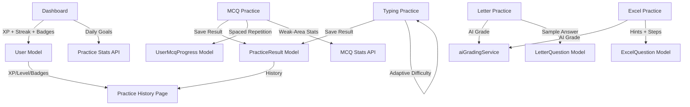

# Practice Zones — Comprehensive Improvement Plan

**Date:** 2026-02-19  
**Scope:** All four practice zones + cross-zone gamification + backend  
**Zones:** Typing Practice, MCQ Practice, Letter Writing Practice, Excel Practice

---

## Current State Analysis

### What Already Works Well
- **Typing Practice** has a solid `TypingEngine`, keyboard heatmap, error analyzer, WPM timeline chart, AI coach, personal record detection with confetti, and two modes (Standard + Simulation/Win97).
- **MCQ Practice** has streak tracking, per-question explanations, and category/difficulty filtering.
- **Letter Practice** has AI grading via Gemini, a rich-text editor with formatting toolbar, and a detailed breakdown panel.
- **Excel Practice** has AI-powered file comparison grading and a timer.
- **Backend** has a well-structured `PracticeResult` model with keystroke-level error tracking for typing.

### Key Gaps Identified

| Zone | Gap |
|---|---|
| Typing | No adaptive difficulty; drill texts are very short single-line strings; no word-count mode; no punctuation/symbol drills |
| MCQ | No post-session review; no per-category history saved to DB; no weak-area surfacing; summary view is minimal |
| Letter | Timer is hardcoded at 3 min; only one random question per session; no sample answer shown after grading |
| Excel | No hints before submission; no solution walkthrough after grading; timer hardcoded at 7 min |
| All Zones | No XP/badge system; no daily streak; no unified practice history page; dashboard practice widget is static |

---

## Improvement Areas

### Area 1 — Typing Practice Enhancements

#### 1A. Adaptive Difficulty Engine
**Problem:** Difficulty is static — user picks Easy/Medium/Hard once and it never changes.  
**Solution:** After each session, auto-suggest the next difficulty based on WPM + accuracy thresholds.

```
If WPM > 50 AND accuracy > 95% on Easy → suggest Medium
If WPM > 70 AND accuracy > 95% on Medium → suggest Hard
If accuracy < 85% on current difficulty → suggest dropping down
```

**Files to change:**
- [`public/js/pages/practice.js`](../public/js/pages/practice.js) — add `suggestNextDifficulty(stats)` function called in `handleSessionComplete`
- [`public/practice-typing.html`](../public/practice-typing.html) — add a "Suggested Next Level" banner in the results view

#### 1B. Word-Count Mode
**Problem:** Only time-based sessions exist (1/2/5 min). Some users prefer to type a fixed number of words.  
**Solution:** Add a "Word Count" toggle in the config view: 25 / 50 / 100 words. The engine completes when the passage is fully typed rather than when the timer expires.

**Files to change:**
- [`public/practice-typing.html`](../public/practice-typing.html) — add word-count selector buttons in `config-grid`
- [`public/js/pages/practice.js`](../public/js/pages/practice.js) — add `mode: 'words'` to config state; pass `wordCount` to `TypingEngine`
- [`public/js/core/TypingEngine.js`](../public/js/core/TypingEngine.js) — add `wordCountMode` flag; trigger `onComplete` when all passage chars are typed

#### 1C. Punctuation & Symbol Drills
**Problem:** [`public/js/core/Drills.js`](../public/js/core/Drills.js) has only 5 drill types; no punctuation or symbol practice.  
**Solution:** Add two new drill types: `punctuation` (.,;:!?'"()-) and `symbols` (@#$%^&*+=<>/).

**Files to change:**
- [`public/js/core/Drills.js`](../public/js/core/Drills.js) — add `punctuation` and `symbols` entries
- [`public/practice-typing.html`](../public/practice-typing.html) — add two new `drill-btn` elements in the drill grid

#### 1D. Drill Aggregate Stats
**Problem:** In [`public/js/pages/practice.js`](../public/js/pages/practice.js:448), `finishDrillSession` only saves the *last* rep's stats. All previous reps are lost.  
**Solution:** Accumulate stats across reps (total chars, total errors, average WPM) and submit the aggregate.

**Files to change:**
- [`public/js/pages/practice.js`](../public/js/pages/practice.js) — add `drillAccumulatedStats` array; merge in `handleDrillRepComplete`; submit aggregate in `finishDrillSession`

---

### Area 2 — MCQ Practice Enhancements

#### 2A. Post-Session Review Mode
**Problem:** The summary view in [`public/practice-mcq.html`](../public/practice-mcq.html:174) only shows a final score and best streak. Users cannot review which questions they got wrong.  
**Solution:** Add a "Review Answers" section in the summary view that lists every question with the user's answer, the correct answer, and the explanation.

**Files to change:**
- [`public/js/pages/practice-mcq.js`](../public/js/pages/practice-mcq.js) — store `userAnswers[]` array during session; render in `showSummary()`
- [`public/practice-mcq.html`](../public/practice-mcq.html) — add `#review-list` container in summary view

#### 2B. Per-Category Accuracy Tracking (Backend)
**Problem:** MCQ practice results are never saved to the database. The `saveResult` endpoint exists in [`controllers/practiceController.js`](../controllers/practiceController.js:164) but is never called from the MCQ frontend.  
**Solution:** Call `POST /api/practice/results` at the end of each MCQ session with `category`, `difficulty`, `score`, `totalQuestions`.

**Files to change:**
- [`public/js/pages/practice-mcq.js`](../public/js/pages/practice-mcq.js) — add `saveMcqResult()` call in `showSummary()`

#### 2C. Weak-Area Targeting
**Problem:** Users have no guidance on which categories to focus on.  
**Solution:** On the selection screen, fetch the user's historical MCQ results and overlay a "Needs Work" badge on categories where accuracy < 60%.

**Files to change:**
- [`controllers/practiceController.js`](../controllers/practiceController.js) — add `getMcqStats` endpoint that aggregates per-category accuracy from `PracticeResult`
- [`routes/practice.js`](../routes/practice.js) — add `GET /api/practice/mcq-stats`
- [`public/js/pages/practice-mcq.js`](../public/js/pages/practice-mcq.js) — fetch stats on load; add "Needs Work" badge to category cards

#### 2D. Question Count Selector
**Problem:** The number of questions per session is fixed by the API (returns all questions for a category).  
**Solution:** Add a "Questions per session" selector (10 / 20 / All) on the selection screen. Pass `?limit=N` to the API.

**Files to change:**
- [`public/practice-mcq.html`](../public/practice-mcq.html) — add question count selector UI
- [`public/js/pages/practice-mcq.js`](../public/js/pages/practice-mcq.js) — pass `limit` param in fetch URL
- [`controllers/mcqController.js`](../controllers/mcqController.js) — respect `limit` query param in `getPracticeQuestions`

---

### Area 3 — Letter Writing Practice Enhancements

#### 3A. Configurable Timer
**Problem:** Timer is hardcoded at `180` seconds in [`public/js/pages/practice-letter.js`](../public/js/pages/practice-letter.js:105).  
**Solution:** Add a timer selector on a pre-test config screen: 3 min / 5 min / 10 min / Untimed.

**Files to change:**
- [`public/practice-letter.html`](../public/practice-letter.html) — add a config view (similar to typing practice) before the test view
- [`public/js/pages/practice-letter.js`](../public/js/pages/practice-letter.js) — read selected duration; pass to `startTimer()`

#### 3B. Sample Answer Reveal
**Problem:** After grading, users see scores but have no reference to compare their letter against.  
**Solution:** Add a "Show Sample Answer" button in the results view that fetches and displays a model answer for the question.

**Backend requirement:** Add `sampleAnswer` field to `LetterQuestion` model and admin UI.

**Files to change:**
- [`models/LetterQuestion.js`](../models/LetterQuestion.js) — add `sampleAnswer: String` field
- [`controllers/practiceController.js`](../controllers/practiceController.js) — include `sampleAnswer` in the grading response
- [`public/practice-letter.html`](../public/practice-letter.html) — add "Show Sample Answer" button + panel in results view
- [`public/js/pages/practice-letter.js`](../public/js/pages/practice-letter.js) — render sample answer on button click

#### 3C. Multiple Attempts / Question Picker
**Problem:** Each page reload gives a random question. Users cannot choose to retry the same question or pick a specific one.  
**Solution:** Add a "Try Again (Same Question)" button in the results view, and a "Pick a Different Question" button that reloads with a new random question without a full page refresh.

**Files to change:**
- [`public/practice-letter.html`](../public/practice-letter.html) — add retry buttons in results view
- [`public/js/pages/practice-letter.js`](../public/js/pages/practice-letter.js) — implement `retryQuestion()` and `loadNewQuestion()` functions

---

### Area 4 — Excel Practice Enhancements

#### 4A. Progressive Hint System
**Problem:** Users download the question file and have no guidance if they get stuck.  
**Solution:** Add a "Get a Hint" button that reveals hints one at a time (up to 3 hints). Each hint costs -1 point from the max score.

**Backend requirement:** Add `hints: [String]` array to `ExcelQuestion` model.

**Files to change:**
- [`models/ExcelQuestion.js`](../models/ExcelQuestion.js) — add `hints: [{ type: String }]` field
- [`public/practice-excel.html`](../public/practice-excel.html) — add hint button + hint display area
- [`public/js/pages/practice-excel.js`](../public/js/pages/practice-excel.js) — implement `revealNextHint()` with penalty tracking; pass `hintsUsed` count to submission

#### 4B. Step-by-Step Solution Walkthrough
**Problem:** After grading, users only see a score and text feedback. They don't know *how* to fix their mistakes.  
**Solution:** After submission, show a "View Solution Steps" panel that lists the key steps to complete the task correctly.

**Backend requirement:** Add `solutionSteps: [String]` to `ExcelQuestion` model.

**Files to change:**
- [`models/ExcelQuestion.js`](../models/ExcelQuestion.js) — add `solutionSteps: [{ type: String }]` field
- [`controllers/practiceController.js`](../controllers/practiceController.js) — include `solutionSteps` in the grading response
- [`public/practice-excel.html`](../public/practice-excel.html) — add solution steps panel in results view
- [`public/js/pages/practice-excel.js`](../public/js/pages/practice-excel.js) — render solution steps

#### 4C. Configurable Timer
**Problem:** Timer is hardcoded at `420` seconds in [`public/js/pages/practice-excel.js`](../public/js/pages/practice-excel.js:51).  
**Solution:** Add a timer selector: 5 min / 7 min / 10 min / Untimed.

**Files to change:**
- [`public/practice-excel.html`](../public/practice-excel.html) — add config view before test view
- [`public/js/pages/practice-excel.js`](../public/js/pages/practice-excel.js) — read selected duration

---

### Area 5 — Cross-Zone Gamification

#### 5A. XP & Level System
**Design:**
- Each practice session earns XP based on performance:
  - Typing: `floor(wpm * accuracy / 100)` XP
  - MCQ: `score * 10` XP
  - Letter: `score * 15` XP
  - Excel: `score * 5` XP
- Levels: Beginner (0–200 XP), Intermediate (201–600 XP), Advanced (601–1200 XP), Expert (1201+ XP)
- XP is stored on the `User` model

**Files to change:**
- [`models/User.js`](../models/User.js) — add `xp: Number`, `level: String` fields
- [`controllers/practiceController.js`](../controllers/practiceController.js) — add `awardXP(userId, amount)` helper called after each save
- [`public/dashboard.html`](../public/dashboard.html) — add XP bar + level badge in header
- [`public/js/pages/dashboard.js`](../public/js/pages/dashboard.js) — fetch and render XP/level

#### 5B. Daily Streak System
**Design:**
- A streak increments when the user completes at least one practice session per calendar day.
- Streak is stored on `User` model: `currentStreak`, `longestStreak`, `lastPracticeDate`.
- A flame icon + streak count appears in the dashboard header.

**Files to change:**
- [`models/User.js`](../models/User.js) — add `currentStreak`, `longestStreak`, `lastPracticeDate` fields
- [`controllers/practiceController.js`](../controllers/practiceController.js) — add `updateStreak(userId)` helper called after each save
- [`public/dashboard.html`](../public/dashboard.html) — add streak badge in header nav
- [`public/js/pages/dashboard.js`](../public/js/pages/dashboard.js) — fetch and render streak

#### 5C. Achievement Badges
**Design:** Unlock badges for milestones:

| Badge | Trigger |
|---|---|
| 🔥 First Practice | Complete first session in any zone |
| ⌨️ Speed Demon | Reach 60 WPM in typing |
| 🎯 Sharpshooter | 100% accuracy in a typing session |
| 📊 MCQ Master | Score 100% in any MCQ session |
| ✉️ Letter Pro | Score 9/10 or higher in letter practice |
| 📅 7-Day Streak | Maintain a 7-day practice streak |
| 🏆 Century | Complete 100 practice sessions total |

**Files to change:**
- [`models/User.js`](../models/User.js) — add `badges: [String]` field
- [`controllers/practiceController.js`](../controllers/practiceController.js) — add `checkAndAwardBadges(userId, stats)` helper
- [`public/dashboard.html`](../public/dashboard.html) — add badges display section
- [`public/js/pages/dashboard.js`](../public/js/pages/dashboard.js) — fetch and render badges

#### 5D. Daily Practice Goals Widget
**Design:** A widget on the dashboard showing today's progress toward a daily goal (e.g., "Complete 3 practice sessions today"). Progress bar fills as sessions are completed.

**Files to change:**
- [`public/dashboard.html`](../public/dashboard.html) — add daily goals card
- [`public/js/pages/dashboard.js`](../public/js/pages/dashboard.js) — fetch today's session count from `/api/practice/stats`

---

### Area 6 — Unified Practice History Page

**Problem:** There is no single place to see all practice history across zones.  
**Solution:** Create a new `practice-history.html` page with:
- Tabs for each zone (Typing / MCQ / Letter / Excel)
- Per-zone stats summary (total sessions, average score, best score)
- A paginated table of past sessions
- A trend chart (score over time)

**New files:**
- `public/practice-history.html`
- `public/js/pages/practice-history.js`

**Backend changes:**
- [`controllers/practiceController.js`](../controllers/practiceController.js) — add `getHistory(userId, zone, page)` endpoint
- [`routes/practice.js`](../routes/practice.js) — add `GET /api/practice/history?zone=typing&page=1`

---

### Area 7 — Backend: Spaced Repetition for MCQ

**Problem:** MCQ questions are served randomly. Users keep seeing questions they already know well.  
**Solution:** Implement a simple SM-2-inspired spaced repetition system:
- Track per-question performance in a new `UserMcqProgress` model: `{ user, questionId, easeFactor, interval, nextReviewDate, timesCorrect, timesWrong }`
- The `/api/mcqs/practice/:category` endpoint prioritizes questions where `nextReviewDate <= today` or questions never seen before.

**New files:**
- `models/UserMcqProgress.js`

**Files to change:**
- [`controllers/mcqController.js`](../controllers/mcqController.js) — modify `getPracticeQuestions` to use spaced repetition ordering
- [`routes/mcq.js`](../routes/mcq.js) — add `POST /api/mcqs/progress` to update question progress after each answer

---

## Implementation Architecture



---

## Prioritized Implementation Order

### Phase 1 — Quick Wins (High Impact, Low Effort)
1. MCQ post-session review mode (frontend only)
2. MCQ save results to DB (one API call addition)
3. Letter "Try Again" and "New Question" buttons
4. Typing word-count mode
5. Punctuation + symbol drills

### Phase 2 — Learning Quality (Medium Effort)
6. Letter sample answer reveal (requires model + admin UI change)
7. Excel hint system (requires model + admin UI change)
8. Excel solution steps (requires model + admin UI change)
9. Adaptive difficulty suggestion for typing
10. MCQ weak-area targeting

### Phase 3 — Gamification (Higher Effort, High Engagement)
11. XP + Level system
12. Daily streak system
13. Achievement badges
14. Daily goals widget on dashboard

### Phase 4 — Advanced Features
15. Unified practice history page
16. Spaced repetition for MCQ
17. Configurable timers for Letter + Excel
18. Drill aggregate stats fix

---

## Files Summary

| File | Changes Needed |
|---|---|
| [`models/User.js`](../models/User.js) | Add xp, level, badges, currentStreak, longestStreak, lastPracticeDate |
| [`models/LetterQuestion.js`](../models/LetterQuestion.js) | Add sampleAnswer field |
| [`models/ExcelQuestion.js`](../models/ExcelQuestion.js) | Add hints[], solutionSteps[] fields |
| `models/UserMcqProgress.js` | New model for spaced repetition |
| [`controllers/practiceController.js`](../controllers/practiceController.js) | Add awardXP, updateStreak, checkBadges, getMcqStats, getHistory helpers |
| [`controllers/mcqController.js`](../controllers/mcqController.js) | Spaced repetition ordering, limit param |
| [`routes/practice.js`](../routes/practice.js) | Add /mcq-stats, /history routes |
| [`routes/mcq.js`](../routes/mcq.js) | Add /progress route |
| [`public/practice-typing.html`](../public/practice-typing.html) | Word-count selector, punctuation/symbol drills, adaptive suggestion banner |
| [`public/js/pages/practice.js`](../public/js/pages/practice.js) | Word-count mode, adaptive difficulty, drill aggregate stats |
| [`public/js/core/TypingEngine.js`](../public/js/core/TypingEngine.js) | Word-count mode flag |
| [`public/js/core/Drills.js`](../public/js/core/Drills.js) | Add punctuation + symbols drills |
| [`public/practice-mcq.html`](../public/practice-mcq.html) | Review list, question count selector, weak-area badges |
| [`public/js/pages/practice-mcq.js`](../public/js/pages/practice-mcq.js) | Review mode, save results, weak-area fetch, question limit |
| [`public/practice-letter.html`](../public/practice-letter.html) | Config view, sample answer panel, retry buttons |
| [`public/js/pages/practice-letter.js`](../public/js/pages/practice-letter.js) | Configurable timer, sample answer, retry/new question |
| [`public/practice-excel.html`](../public/practice-excel.html) | Config view, hint UI, solution steps panel |
| [`public/js/pages/practice-excel.js`](../public/js/pages/practice-excel.js) | Configurable timer, hint system, solution steps |
| [`public/dashboard.html`](../public/dashboard.html) | XP bar, streak badge, badges section, daily goals card |
| [`public/js/pages/dashboard.js`](../public/js/pages/dashboard.js) | Fetch + render XP, streak, badges, daily goals |
| `public/practice-history.html` | New page |
| `public/js/pages/practice-history.js` | New page JS |
